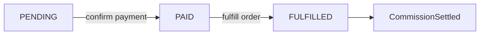

# Gas Package / 商城订单分佣文档

本文档描述当前 `GasPackage` 订单的后端流程。该流程现作为“商城订单接入推广分佣底座”的参考实现：

- 支付确认后只把订单标记为已支付。
- 履约完成后才发货并结算推广佣金。
- 推广佣金写入独立的商城佣金账户，不再进入 `gasBalance`。

---

## 1. 订单状态流转



说明：

- `PENDING`：订单已创建，尚未确认支付。
- `PAID`：支付已确认，但还未履约，也不会提前发佣。
- `FULFILLED`：履约完成，买家权益已发放，推广佣金已完成结算。
- `commissionSettlementStatus`：独立标记佣金结算状态，当前履约成功后写为 `SETTLED`。

---

## 2. 相关数据模型

### `GasPackageOrder`

新增或重点使用字段：

- `status`
- `txHash`
- `paymentConfirmedAt`
- `fulfilledAt`
- `commissionSettlementStatus`
- `commissionSettledAt`
- `gasOrderId`

### `MallCommissionAccount`

记录用户商城佣金账户余额：

- `availableBalance`
- `totalEarned`
- `totalSettled`
- `totalReversed`

### `MallCommissionLedger`

记录商城佣金流水：

- `entryType`
- `change`
- `balanceAfter`
- `sourceType`
- `sourceOrderId`
- `ruleVersion`

### `MallOrderCommission`

记录单笔订单产生的分佣明细：

- `orderId`
- `fromUserId`
- `toUserId`
- `level`
- `commissionAmount`
- `settlementStatus`
- `sourceType`
- `sourceOrderId`
- `ruleVersion`
- `tierAtTheTime`
- `rateAtTheTime`

---

## 3. 接口

基础路径：`/api/gas-packages`

### 3.1 创建订单

**POST** `/api/gas-packages/orders`

请求体：

```json
{
  "userId": 1,
  "packageId": 2,
  "walletAddress": "0x..."
}
```

作用：

- 创建 `PENDING` 订单。
- 返回套餐快照和建议支付信息。
- 此时不会发货，也不会结算推广佣金。

### 3.2 确认支付

**POST** `/api/gas-packages/orders/:id/confirm`

请求体：

```json
{
  "txHash": "0x..."
}
```

作用：

- 将订单从 `PENDING` 更新为 `PAID`。
- 写入 `txHash` 和 `paymentConfirmedAt`。
- 不发货，不结算佣金。

### 3.3 履约完成并结算佣金

**POST** `/api/gas-packages/orders/:id/fulfill`

作用：

- 要求订单当前状态必须为 `PAID`。
- 在同一事务内完成以下动作：
  - 创建 `GasOrder` 作为买家权益发放记录，`sourceType = MALL_ORDER`
  - 给买家增加 `gasBalance`
  - 写入 `GasBalanceLog`，类型为 `PACKAGE_FULFILLMENT`
  - 计算推荐链分佣
  - 写入 `MallOrderCommission`
  - 更新 `MallCommissionAccount`
  - 写入 `MallCommissionLedger`
  - 将订单更新为 `FULFILLED`
  - 写入 `commissionSettlementStatus = SETTLED`

---

## 4. 分佣口径

- 分佣触发时点：履约完成后。
- 分佣基数：当前实现按订单 `paidUsd` 计算。
- 分佣规则：沿用推广档位差额分佣逻辑，保留 `tierAtTheTime` 与 `rateAtTheTime` 快照。
- 佣金入账位置：`MallCommissionAccount.availableBalance`。
- 买家权益发放位置：`gasBalance`，与商城佣金账户分离。

---

## 5. 幂等与后续扩展

- `confirm` 对已 `PAID` / `FULFILLED` 的订单保持幂等返回。
- `fulfill` 对已 `FULFILLED` 且 `commissionSettlementStatus = SETTLED` 的订单保持幂等返回。
- 当前已为后续退款/冲正预留模型字段：
  - `MallOrderCommission.settlementStatus`
  - `MallOrderCommission.reversedAt`
  - `MallCommissionLedger.entryType`
  - `MallCommissionAccount.totalReversed`

后续如果接正式商城订单，可继续沿用这套“支付确认”和“履约结算”拆分模型，而不需要再回到 `Gas` 充值分佣路径。
